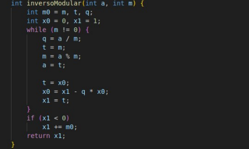

# Resolução da Questão 




* Aluno => Lucas Andrade Zanetti
* Matrícula => 241039645

------------------------------------------------------
## Questão 4 - Correção do código e teste com valores 

- Entrada H: 7, G: 3, Zn: 11, x: 10, n1: 13
```
Saída Gerada:
Insira H: 7
Insira G: 3
Insira Zn: 11
Insira x: 10
Insira n1: 13

Algoritmo de Euclides: 3 mod 11 = 3
Algoritmo de Euclides: 11 mod 3 = 2
Algoritmo de Euclides: 3 mod 2 = 1
Algoritmo de Euclides: 2 mod 1 = 0

Substituindo, temos que o inverso de 3 em 11 é 4.

Fazendo a multiplicação modular: 7 * 4 mod 11 = 6
Sendo 4 o inverso de 3.
Valor final da congruência: 4
```
Saída Esperada!!

-----------
Abaixo está a classificação de cada afirmativa como Verdadeira (V) ou Falsa (F), com justificativas curtas e objetivas.

---

**(V) O algoritmo de Euclides estendido é utilizado para calcular o inverso modular de um número.**

* **Justificação:** O código `inversoModular` é uma implementação do Algoritmo de Euclides Estendido, cujo objetivo é encontrar $x$ na equação $ax \equiv 1 \pmod{m}$, onde $x$ é o inverso modular.

---

**(F) Se $\text{mdc}(G, Zn) \neq 1$, o programa ainda consegue encontrar o inverso de G em Zn.**

* **Justificação:** O inverso modular de $G$ em $Zn$ só existe, por definição, se $G$ e $Zn$ forem primos entre si, ou seja, $\text{mdc}(G, Zn) = 1$.

---

**(V) A operação `(H * inverso) % Zn` representa a divisão modular de H por G.**

* **Justificação:** A divisão modular $H \div G \pmod{Zn}$ é definida como a multiplicação de $H$ pelo inverso modular de $G$. A expressão calcula exatamente $H \cdot G^{-1} \pmod{Zn}$.

---

**(V) Se n1 for primo, o código aplica o Pequeno Teorema de Fermat para simplificar o cálculo de $a^x \pmod{n1}$.**

* **Justificação:** O Pequeno Teorema de Fermat é o caso especial do Teorema de Euler para módulos primos. Ele otimiza o cálculo de $a^x \pmod{n1}$ reduzindo o expoente para $x \pmod{n1-1}$.

---

**(F) A função powMod implementa o cálculo de potência modular utilizando multiplicações diretas sem otimização.**

* **Justificação:** Multiplicações diretas são muito ineficientes ($O(x)$). Funções de exponenciação modular usam algoritmos otimizados, como a **exponenciação por quadratura** (ou binária), que tem complexidade $O(\log x)$.

---

**(V) Quando o resultado do inverso é negativo, o código ajusta o valor somando o módulo m0.**

* **Justificação:** O trecho `if (x1 < 0) { x1 += m0; }` existe para converter um inverso negativo (válido matematicamente) no seu representante positivo equivalente dentro do módulo, que é a convenção.

---

**(V) O cálculo de $\phi(n1)$ (função totiente de Euler) é utilizado apenas quando n1 não é primo.**

* **Justificação:** Se $n1$ é primo, $\phi(n1) = n1-1$ (usado por Fermat), que é trivial. Se $n1$ não é primo, o Teorema de Euler exige o cálculo explícito de $\phi(n1)$ para reduzir o expoente.